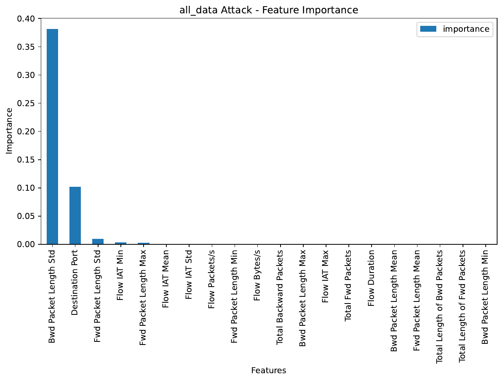
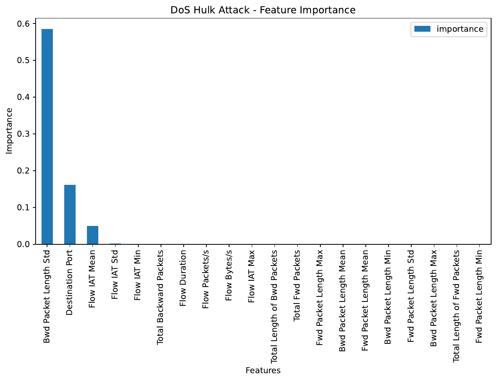
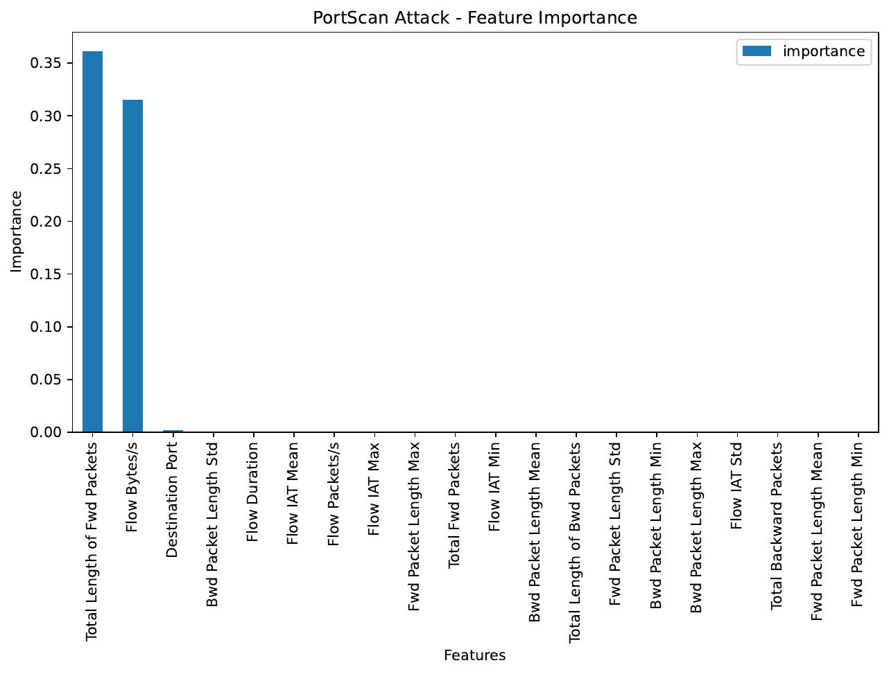
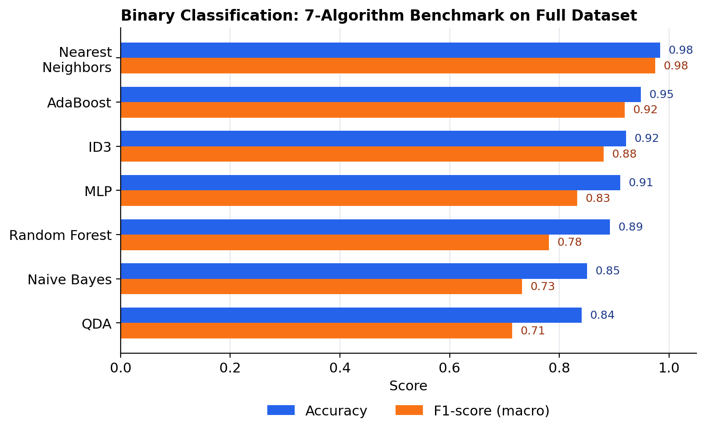
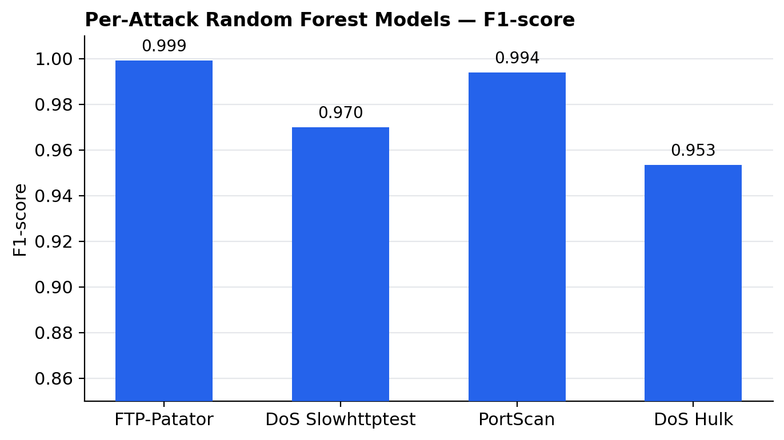
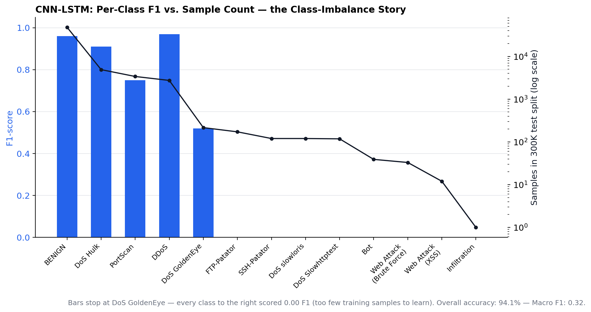

# NADS — Network Anomaly Detection System

A machine learning pipeline for detecting and classifying network intrusions from flow-level traffic data, built on the CICIDS2017 dataset. NADS combines a feature-engineered classical ML pipeline with per-attack-type ensemble models and a CNN-LSTM sequence model for temporal flow analysis.

---

## Overview

NADS ingests raw CICIDS2017 packet-flow CSVs (8 days of labeled benign/attack traffic captured via CICFlowMeter) and runs them through a pipeline that cleans the data, selects discriminative features per attack type, benchmarks classical ML algorithms, then layers in per-attack ensembles and a sequence-based deep learning model.

The dataset spans 14 traffic classes: **BENIGN**, **DoS Hulk**, **DoS GoldenEye**, **DoS Slowhttptest**, **DoS slowloris**, **DDoS**, **PortScan**, **Bot**, **FTP-Patator**, **SSH-Patator**, **Web Attack (Brute Force / XSS / SQL Injection)**, **Infiltration**, and **Heartbleed**.

| Stage | Description | Output |
|---|---|---|
| 1. Preprocessing | Clean, merge, and encode 8 raw CICIDS2017 CSVs | `all_data.csv` |
| 2. Class Distribution | Analyze benign/attack class balance | Distribution stats |
| 3. Per-Attack Filtering | Split into 14 attack-specific CSVs | `attacks/*.csv` |
| 4. Feature Selection | Rank flow features via RandomForestRegressor importance | Feature importance lists |
| 5. Classical ML Benchmark | Benchmark 7 algorithms with 10-fold splits | `results_Final.csv` |
| 6. Per-Attack Random Forest | Dedicated RF classifier per attack category | `*_model.pkl` |
| 7. RF + MLP Voting Ensemble | Soft-voting ensemble per attack category | `*_voting_model.pkl` |
| 8. CNN-LSTM Sequence Model | Sliding-window temporal classifier across all classes | `final_cnn_lstm_model.h5` |

---

## Pipeline

### 1. Preprocessing (`01_preprocessing.py`)
Merges 8 raw CICIDS2017 CSVs into a single `all_data.csv`. Handles malformed rows, encoding issues in attack-label strings, `Infinity`/`NaN` values in `Flow Bytes/s` and `Flow Packets/s`, and label-encodes categorical columns.

### 2. Class Distribution Analysis (`02_statistics.py`)
Profiles class balance across the merged dataset. The dataset is heavily imbalanced — BENIGN traffic dominates, while attacks like Heartbleed (11 samples) and Infiltration (36 samples) are extremely rare relative to DoS Hulk (231K+ samples).

### 3. Per-Attack Filtering (`03_attack_filter.py`)
Splits the merged dataset into one CSV per attack type, each paired with a proportionally sampled slice of benign traffic (~30:70 attack-to-benign ratio).

### 4. Feature Selection (`04_1`, `04_2`)
Uses a `RandomForestRegressor` to rank flow features by importance, run separately per attack type and on the full combined dataset.



**Bwd Packet Length Std** and **Destination Port** dominate global feature importance — consistent with the intuition that response-traffic shape and targeted service/port are the strongest tells of an attack flow. Per-attack rankings (below) shift depending on attack mechanics:

<table>
<tr>
<td></td>
<td></td>
</tr>
</table>

### 5. Classical ML Benchmarking (`05_1`–`05_4`)
Benchmarks Naive Bayes, QDA, MLP, Random Forest, ID3 (Decision Tree), AdaBoost, and k-Nearest Neighbors on the full dataset using the top 20 selected features, with 10-fold repeated train/test splits, binary attack-vs-benign classification.



Nearest Neighbors and AdaBoost led the binary classification benchmark; Naive Bayes and QDA — the two algorithms assuming feature independence/Gaussian distributions — trailed, unsurprising given how correlated flow-level features tend to be.

### 6. Per-Attack Random Forest Models 
A dedicated `RandomForestClassifier` trained per attack category using that attack's top-5 importance-ranked features, saved individually (`<Attack>_model.pkl`).



### 7. RF + MLP Voting Ensemble 
For each attack category, a soft-voting ensemble combining the Random Forest with an MLPClassifier, aimed at improving robustness on attack types where the two model families disagree (saved as `<Attack>_voting_model.pkl`).

### 8. CNN-LSTM Sequence Model 
Reframes detection as a sequence problem: 17 flow features are standardized and grouped into sliding windows of 10 consecutive flows, then passed through a `Conv1D → BatchNorm → SpatialDropout → LSTM(128) → LSTM(64) → Dense` stack trained for multi-class classification (14 classes).

**Results (5 epochs, 300K-row stratified sample, 80/20 split):**
- Overall accuracy: **94.1%**
- Macro F1-score: **0.32**



The accuracy/macro-F1 gap is the most important finding from this component, not a footnote: the model performs strongly on high-frequency classes (BENIGN: 0.96 F1, DDoS: 0.97 F1, DoS Hulk: 0.91 F1) but collapses to 0 recall on rare classes with too few training examples in a 300K-row sample (FTP-Patator, Heartbleed, SSH-Patator, Bot, Infiltration). This is a direct, expected consequence of CICIDS2017's severe class imbalance, documented here deliberately since it's the main target for future work (class weighting, SMOTE-style oversampling, or training on the full dataset rather than a sample).

---

## Tech Stack

- **Languages:** Python
- **Classical ML:** scikit-learn (Random Forest, AdaBoost, MLP, KNN, Decision Trees, Naive Bayes, QDA)
- **Deep Learning:** TensorFlow / Keras (Conv1D + LSTM hybrid)
- **Data:** pandas, NumPy
- **Visualization:** Matplotlib
- **Dataset:** CICIDS2017 (Canadian Institute for Cybersecurity)

---

## Repository Structure

```
NADS/
├── 01_preprocessing.py                          # Merge & clean raw CICIDS2017 CSVs
├── 02_statistics.py                             # Class distribution analysis
├── 03_attack_filter.py                          # Per-attack CSV splitting
├── 04_1_feature_selection_for_attack_files.py   # Per-attack feature importance
├── 04_2_feature_selection_for_all_data.py       # Global feature importance
├── 05_1 .. 05_4_*.py                            # Classical ML benchmarking sweeps
├── modeltrain.ipynb                             # RF ensembles, voting classifiers, CNN-LSTM
├── attacks/                                     # Per-attack-type CSV splits
├── dataset/                                     # NSL-KDD benchmark reference set
├── feaure_pics/                                 # Feature importance plots (per attack)
├── results/                                     # Benchmark result CSVs + plots
├── assets/                                      # README chart images
├── *_model.pkl                                  # Per-attack Random Forest models
├── *_voting_model.pkl                           # Per-attack RF+MLP voting ensembles
├── final_cnn_lstm_model.h5                      # Trained CNN-LSTM sequence model
└── final_scaler.pkl                             # StandardScaler used for CNN-LSTM input
```

---

## Limitations & Future Work

- **Class imbalance** is the dominant limitation — rare attack classes need oversampling, class weighting, or a full-dataset training run instead of sampling.
- The CNN-LSTM was trained on a 300K-row sample, not the full ~2.8M-row dataset, due to local compute constraints.
- No live packet-capture integration yet — the system currently operates on pre-extracted CICFlowMeter flow features, not raw `.pcap` streams.
- Web Attack subtypes (Brute Force / XSS / SQL Injection) are currently merged into a single "Web Attack" class; subtype-level classification was not evaluated.

---

## Acknowledgements

The initial preprocessing, feature-selection, and classical-ML-benchmarking pipeline (steps 1–5 above) extends an existing open-source CICIDS2017 anomaly detection project. The per-attack ensemble models, the RF+MLP voting classifiers, and the CNN-LSTM sequence model (steps 6–8) are original work built on top of that foundation.
